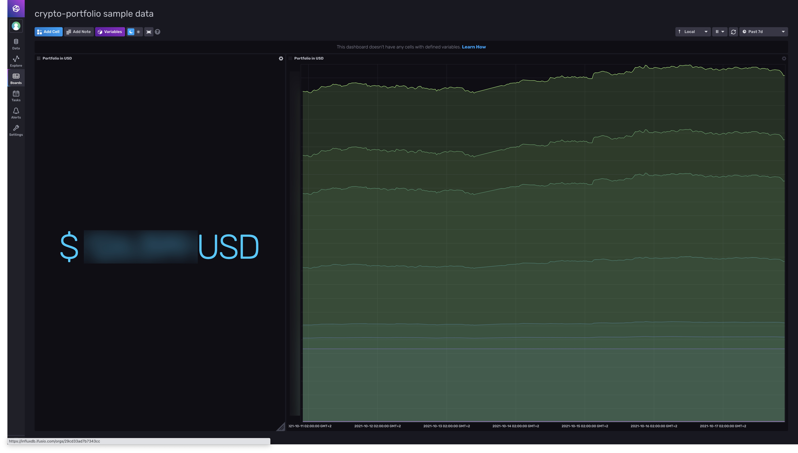

# crypto-portfolio

This project summarizes your crypto portfolio accross exchanges in a single view.

It is based on the following components:
* `influxdb` as a data storage and visualizer
* `nodejs` for collecting data through exchanges using `ccxt` library
* `docker` for running code and database

## Getting started

### Configuration

Create a `config.json` file based on `config-sample.json` provided in this directory.

#### Exchanges

##### `label` vs. `name`

`label` is declarative name that will be used to identify an account in influxdb.
`name` is the actual name of the exchange, which should match `ccxt` exchanges supported list.

##### `params`

It allows to pass additional params to exchange.
As you can see in the config sample file, it can be used on the `deribit` example to get `ETH` instead of `BTC`.

### docker-compose.yml

```
version: '2'
services:
  influxdb:
    restart: always
    image: influxdb:2.0-alpine
    container_name: influxdb
    environment:
      - "DOCKER_INFLUXDB_INIT_MODE=setup"
      - "DOCKER_INFLUXDB_INIT_USERNAME=<USERNAME>"
      - "DOCKER_INFLUXDB_INIT_PASSWORD=<PASSWORD>"
      - "DOCKER_INFLUXDB_INIT_ORG=<ORG_NAME>"
      - "DOCKER_INFLUXDB_INIT_BUCKET=crypto"
      - "DOCKER_INFLUXDB_INIT_ADMIN_TOKEN=<A_SECURED_TOKEN>"
  crypto-portfolio:
    restart: always
    image: tvial/crypto-portfolio
    volumes:
      - nodejs/config.json:/usr/src/app/config.json
    container_name: crypto-portfolio
    depends_on:
      - influxdb
```

## Influxdb dashboard

A default dashboard showing portfolio value in USD is available in `influxdb/` folder.
Import it in influxdb boards panel and customize it to fit your needs.

Example:


